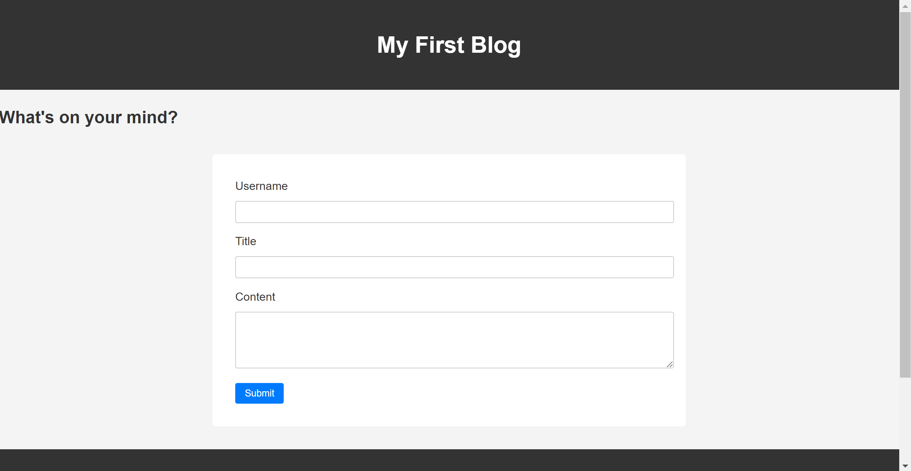
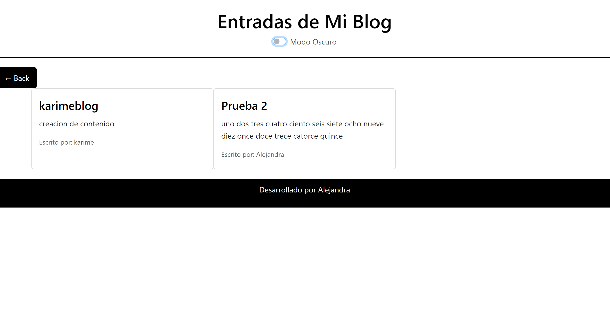

# BlogBuilderJS

## Description

This project is a personal blog application designed to allow users to post their thoughts and experiences. I built this project to deepen my understanding of web development using HTML, CSS, and JavaScript, and to demonstrate my ability to work with client-side storage and event handling.

- **Motivation**: The motivation behind this project was to create a functional web application that could serve as a personal blogging platform.
- **Problem Solved**: This application provides a simple and user-friendly interface for users to publish their blog posts without the need for backend infrastructure, using `localStorage` to store data persistently on the client's machine.
- **What I Learned**: Through this project, I learned about DOM manipulation, event handling in JavaScript, and the use of `localStorage` to store and retrieve data. I also improved my skills in responsive web design using Bootstrap.

## Table of Contents

- [Installation](#installation)
- [Usage](#usage)
- [Credits](#credits)
- [License](#license)

## Installation

To get started with this project, clone the repository and open the HTML files in your favorite web browser.

```bash
git clone https://your-github-repo-link.git
cd your-project-folder
open index.html
```

## Usage
To use the blog:
Open index.html in your browser to see the landing page.
Enter your username, title for your blog post, and the content of your post.
Click on "Submit" to save your post to localStorage and be redirected to blog.html, where you can view all posts.

# Screenshots





## Credits
This project is released under the MIT License. see the LICENSE.md File for details.


## Features

- **Blog Post Creation**: Users can create and submit blog posts.
- **View Posts**: Users can view all blog posts on a separate page.
- **Light/Dark Mode**: Users can toggle between light and dark mode for easier reading.
